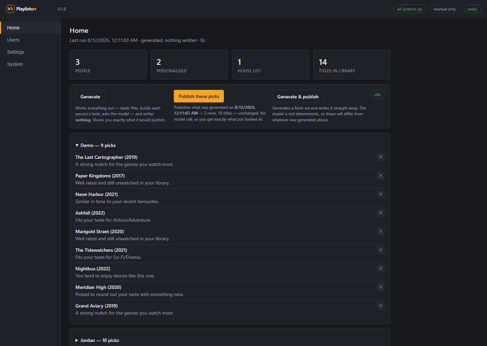
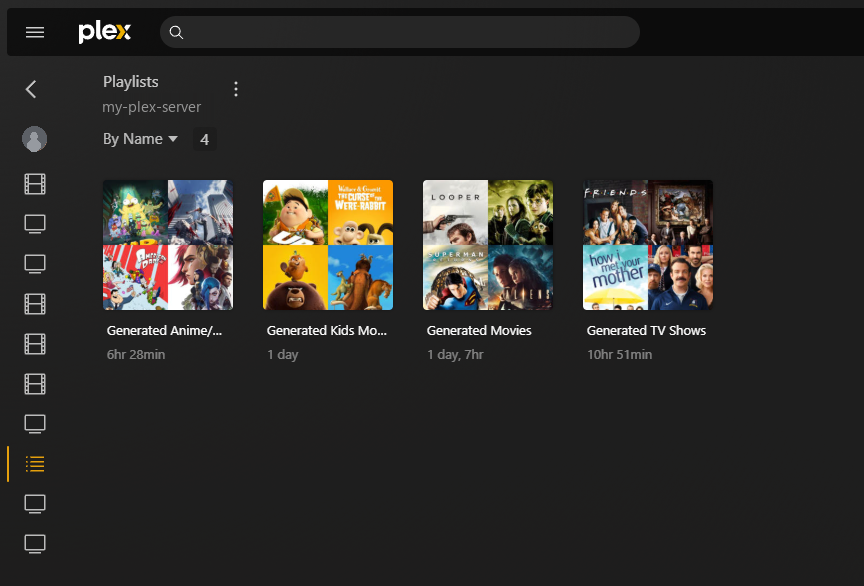
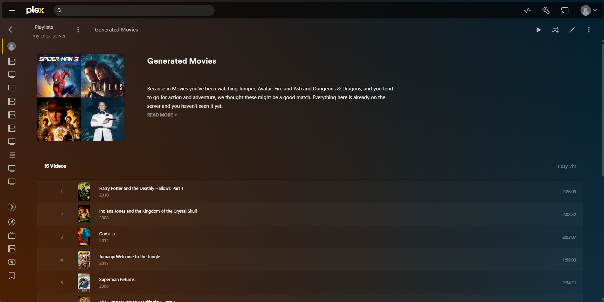
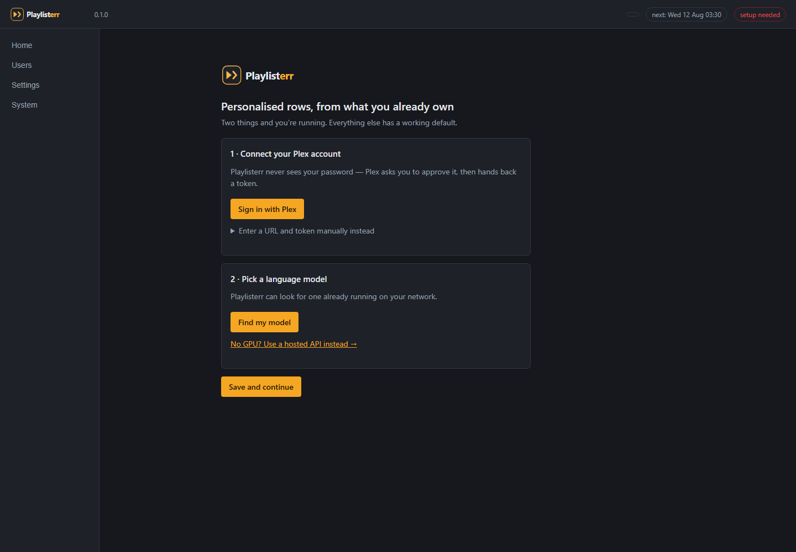
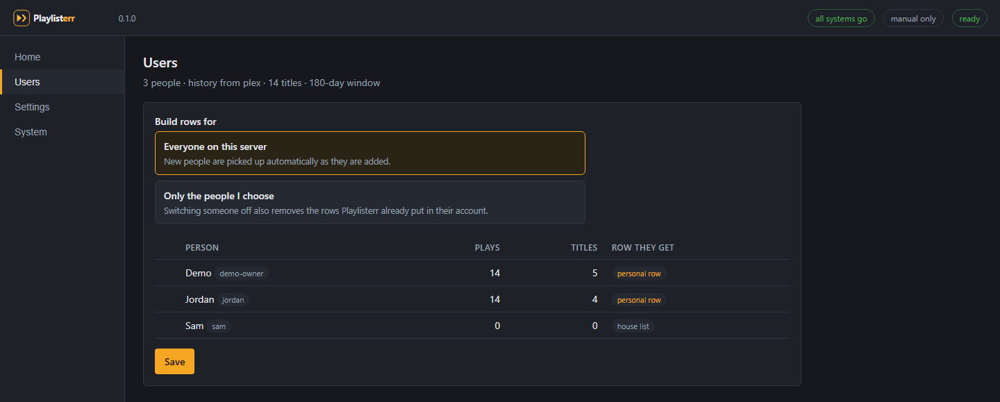
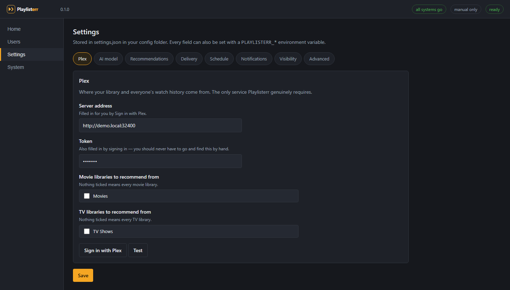
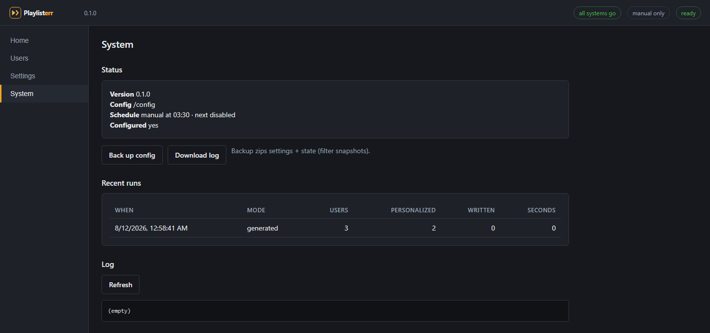

<div align="center">


**Personalized "watch next" rows in every Plex user's own account —
chosen by a local LLM from titles you already own.**

[](LICENSE)
[](https://www.python.org/)
[](#no-dependencies)
[](CONTRIBUTING.md)

</div>

---

On a schedule, Playlisterr reads each Plex user's watch history, works out what
they actually like, and asks a language model to pick ~15 unwatched titles
*from your library* — each with a one-line reason. It drops them into that
person's own account as one row per library, named after your own libraries —
**Generated Movies**, **Generated TV Shows**, **Generated Kids Movies**, or
whatever yours are actually called. Nobody visits a website. Nobody requests
anything. The recommendations just show up in Plex.

<div align="center">

</div>

Playlisterr **only ever arranges what you already have**. It never downloads,
never requests, never writes to Radarr or Sonarr, and never touches a row it
did not create.

Each row explains itself — the description Playlisterr writes into the Plex
playlist reads like this:

```
Because in Movies you've been watching The Long Ferry, Glass Orchard and
The Quiet Engine, and you tend to go for drama and mystery, we thought
these might be a good match. Everything here is already on the server and
you haven't seen it yet.

• The Last Cartographer (2019) — A strong match for the genres you watch most.
• Paper Kingdoms (2017)        — Well rated and still unwatched in your library.
• Neon Harbor (2021)           — Similar in tone to your recent favourites.
  …

Picked for you on 12 Aug 2026 · refreshed nightly by Playlisterr.
```

### …and here it is, in Plex

The rows land in each person's own Plex, right alongside their other
playlists — one per library, added to the left-hand menu. No new app to open,
nothing to log into.

<div align="center">

</div>

Open one and the blurb explains itself — the same reasons written straight into
the Plex playlist description:

<div align="center">

</div>

## What makes it different

Playlisterr is *ambient*. The recommendations come to the viewer — inside Plex,
per person, refreshed while everyone sleeps. There's no website to open and
nothing to request; the picks are simply waiting the next time someone hits
play. And because a Plex playlist belongs to an account, **each person sees
only their own row — you included.**

## Highlights

- 🎬 **Per-user, per-library rows** — "Generated Kids Movies" is picked from
  the *kids'* viewing, not the account owner's, even when they share one login.
- 🔒 **Actually private** — playlists are per-account, so nobody sees anyone
  else's picks. No filters to fight over.
- 🧠 **Any LLM** — a local [Ollama](https://ollama.com), or any
  OpenAI-compatible endpoint (LM Studio, vLLM, OpenRouter, OpenAI). The model
  is kept on a short leash: it can only pick from titles you own, and every
  pick is validated.
- 🪄 **Two-click setup** — Sign in with Plex (no token hunting), auto-detect
  your model. <a href="#quick-start">See below.</a>
- 🔔 **Runs unattended** — nightly schedule, webhook notifications on success
  and failure, a health panel so a dead model surfaces *now*, not at 3am.
- 🚫 **Never-recommend** — one click vetoes a title forever.
- 🧱 **Standard library only** — <a id="no-dependencies"></a>no pip packages,
  no build step, one small container. It installs like the \*arr apps you
  already run.

## Quick start

### Docker

Clone the repo and bring it up — the image builds from the included
`Dockerfile`, so there's nothing to pull and no account to sign up for:

```bash
git clone https://github.com/JamesClayPatton/playlisterr && cd playlisterr
docker compose up -d
```

The bundled [`docker-compose.yml`](docker-compose.yml) is the whole config:

```yaml
services:
  playlisterr:
    build: .                     # builds from this checkout, nothing is pulled
    container_name: playlisterr
    environment:
      - PUID=1000
      - PGID=1000
      - TZ=Etc/UTC
    volumes:
      - ./config:/config
    ports:
      - 8484:8484
    restart: unless-stopped
```

Open `http://<host>:8484` and the wizard is two clicks — **Sign in with Plex**
(the same approval flow Overseerr uses, no token hunting) and **Find my model**
(it probes your network for Ollama/LM Studio/vLLM and picks a good one):

<div align="center">

</div>

Everything after that has a working default. Full options in
[docs/INSTALL.md](docs/INSTALL.md) and [docs/CONFIGURATION.md](docs/CONFIGURATION.md).

### Try it with no Plex server

Every checkout ships a fictional sample so you can see the whole thing run —
UI and all — against demo data:

```bash
git clone https://github.com/JamesClayPatton/playlisterr && cd playlisterr
python -m playlisterr serve --demo    # the UI on sample data, nothing real contacted
# ...or the pipeline in the terminal:
python -m playlisterr run --offline
```

## A tour

| | |
|---|---|
|  | **Users** — see who qualifies for a personal row and who gets the shared house list, and choose exactly who takes part (with search and select-all). |
|  | **Settings** — every option explained where you set it. Ollama shows no API-key box; OpenAI does. Libraries are checkboxes off your real server, not free text. |
|  | **System** — run history, a live log, one-click config backup, and a scheduler you control. |

The whole UI is a single dependency-free page that stays usable from a
widescreen down to a phone.

## How it works

```
1. Users        who to build rows for (owner + shared users, minus anyone off)
2. History      per-account watch history, episodes mapped to their show
3. Candidates   every owned title, minus what that person has watched
4. Profile      per user, per library: genres, eras, favourites — no model
5. Pick         the model picks from a numbered candidate list and gives a
                reason; ids are validated, reasons checked for invented history
6. Publish      create/update the row, set the reasons as its blurb
7. Report       run log + a webhook ping
```

Steps 1–4 and 6–7 are ordinary Python. **Only step 5 talks to a model, and
nothing it says is trusted without checking** — a hallucinated title is a
dropped pick, not a recommendation for something nobody owns. The reasoning
behind each choice is in [docs/DESIGN.md](docs/DESIGN.md).

### How rows reach people

A Plex *playlist* belongs to an account; a *collection* is server-wide. That's
the whole choice:

- **`playlist`** (default) — private to each account, owner included. Everyone
  sees only their own row. TV picks become the next unwatched episode.
- **`collection`** — real "Recommended" library rows, which look better, but a
  collection is shared: everyone with library access sees every row.

## Privacy & safety

- Playlisterr reads **every** account's history to build recommendations, not
  just yours. `users.mode: selected` limits it to chosen accounts.
- Watch history stays on your server **unless** you choose a hosted LLM, in
  which case a candidate list + short taste summary is sent to that provider
  per run. A local Ollama keeps everything on your LAN.
- It writes **only** rows carrying its own label; everything else is read-only.
- A plain `run` writes nothing — you ask for `--publish`.
- Tokens and emails are redacted from logs, errors, and recorded fixtures.
- Kill the container and Plex is untouched; the rows just stop refreshing.

See [SECURITY.md](SECURITY.md) for the threat model.

## Documentation

- **[Installation](docs/INSTALL.md)** — Docker, source, bare-metal, PUID/PGID
- **[Configuration](docs/CONFIGURATION.md)** — every setting, with defaults
- **[FAQ](docs/FAQ.md)** — common questions and gotchas
- **[Design notes](docs/DESIGN.md)** — why it's built this way

## Contributing

Playlisterr is open source and contributions are welcome — bug reports, ideas,
and pull requests. A good first step is to open an issue to talk it through.

- **Found a bug or have an idea?** [Open an issue](../../issues/new/choose).
- **Want to change code?** Read [CONTRIBUTING.md](CONTRIBUTING.md) first — the
  two ground rules (standard library only, no build step) shape what gets
  merged — then send a PR.
- **Found a security issue?** Please report it privately per
  [SECURITY.md](SECURITY.md), not as a public issue.

Everyone taking part is expected to follow our
[Code of Conduct](CODE_OF_CONDUCT.md).

## License

Playlisterr is free and open-source software under the **GNU AGPL v3** — see
[LICENSE](LICENSE). Use it, self-host it, fork it, modify it. The one catch:
if you distribute it or run a modified version as a network service, you have
to share your source under the same license — so it stays free for everyone
and nobody can turn it into a closed, paid product. Not affiliated with Plex.
